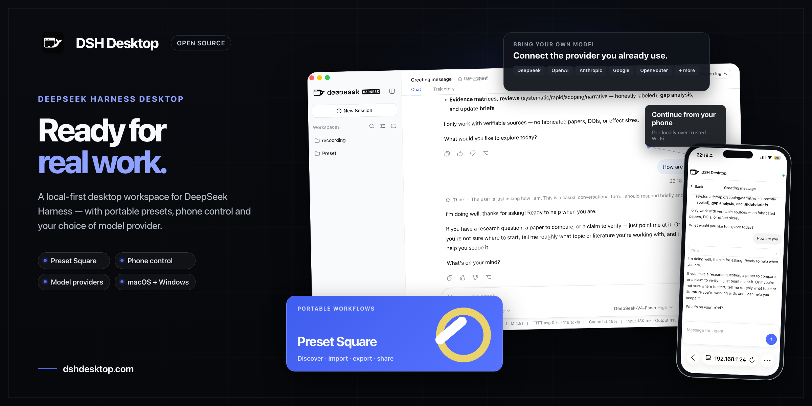

<h1 align="center">
  
  DSH Desktop
</h1>

<p align="center">
  A local-first, cross-platform desktop shell for
  <a href="https://github.com/deepseek-ai/deepseek-harness">DeepSeek Harness</a>.
</p>

<p align="center">
  <a href="README.md">English</a> · <a href="README.zh.md">简体中文</a>
</p>

<p align="center">
  <a href="LICENSE"></a>
  
  
</p>



<p align="center"><strong>除了 DeepSeek 官方模型，DSH Desktop 也支持主流第三方模型提供方。更多基于 DSH 的有趣桌面体验即将推出。</strong></p>

DSH Desktop 把 DeepSeek Harness 的本地 Web 体验封装为桌面应用：应用会自动启动本地 Harness、管理随机回环端口、持久化 Profile/插件/会话，并在 Harness 就绪后直接进入完整界面。项目工作区在 Harness 界面中统一添加和管理。

> [!IMPORTANT]
> DSH Desktop 当前处于早期预览阶段，并依赖仍在快速迭代的 `@deepseek-ai/dsh@0.1.0-rc.7`。macOS 正式包已完成代码签名并通过 Apple 公证，当前安装包统一通过官网分发。

## 下载安装

请前往 [DSH Desktop 官网](https://www.dshdesktop.com/#download)下载 macOS 和 Windows 安装包。

已安装的 macOS 和 Windows 版本会在启动后及每六小时自动检查更新。更新将在后台下载，准备完成后提示重启安装；也可以从应用菜单选择 **检查更新…** 手动检查。

## 加入社区

<p align="center">
  使用微信扫描下方二维码，加入 DSH Desktop 微信交流群。<br />
  <br />
  也可以加入 <a href="https://discord.gg/he2gAKCpj">DSH Desktop Discord 社区</a>。
</p>

## 为什么做这个项目

DeepSeek Harness 本身提供完整的 Agent Runtime 与 Web UI。DSH Desktop 不重新实现 Harness，而是补上桌面产品所需的宿主能力：

- 无需手动运行 CLI 或管理本地端口
- 启动时自动创建应用专属的 Harness 启动目录
- 通过 Harness 内置目录选择器统一添加和管理项目工作区
- 统一管理 Harness 子进程、启动检测、日志与退出
- 把 Profile、插件和会话保存在应用安装目录之外，升级应用不丢数据
- 提供 macOS 与 Windows 安装包构建入口

## 功能

- 启动后直接进入 Harness，不设置额外首页
- 启动时无需先选择目录，自动创建并复用应用内部启动目录
- Harness 启动失败时支持重试、查看日志或退出
- Harness 菜单支持重启子进程与查看日志
- 退出桌面应用时优雅终止 Harness 子进程
- 每次启动仅监听随机的 `127.0.0.1` 端口
- Renderer 关闭 Node.js 权限，启用 `contextIsolation`、sandbox 与导航限制
- 在桌面窗口与 Harness 侧栏统一使用 DSH 品牌 Logo
- 可把完整的自定义 Agent 预设导入/导出为便携的 [`.dshpreset` 压缩包](docs/preset-packages.md)，安装前会检查命名冲突并提示信任风险
- 正式 DSH 应用图标，支持 macOS ICNS 与 Windows ICO

## 友情链接

[dsh-market](https://github.com/dsh-market/dsh-market) — DeepSeek Harness 插件市场：浏览、搜索社区 900+ 插件，截图预览、一键安装 / 更新 / 启停 / 换主题，多数插件免重启即时生效。

## 快速开始

### 环境要求

- Node.js 22 或更新版本
- npm；构建 Harness 还需要 pnpm 11
- macOS Apple Silicon/Intel，或 Windows x64

### 本地开发

本外壳自身不含 Harness。`@deepseek-ai/dsh` 与 `@deepseek-ai/dsh-web-frontend`
经由 `file:../apps/cli` 和 `file:../apps/web` 解析，因此 Harness 源码必须作为本项目的
**同级目录**先检出并构建：

```bash
# 1. 先检出本外壳所打包的 Harness
git clone <harness-repository> harness
cd harness
pnpm install
pnpm run build          # 产出 apps/cli/lib 与 apps/web/dist

# 2. 再把本项目检出到它内部
git clone https://github.com/dataelement/dsh-desktop.git
cd dsh-desktop
npm install
npm run dev
```

只检出本项目会“看起来正常”：npm 会创建这两个链接却不检查目标是否存在，并以 0 退出，
于是安装与打包都“成功”，产出的应用其 Harness 入口却是一条断链。
`scripts/verify-harness-checkout.mjs` 会在安装与构建时拒绝这种结果；CI 也会在任何任务开始前做同样的检查。

### 质量检查

```bash
npm test
npm run typecheck
npm run build
```

### 打包

```bash
# 在当前 Mac 架构上生成未签名 DMG 与 ZIP
npm run package:mac

# 分别在对应架构的 Mac/CI Runner 上执行
npm run package:mac:arm64
npm run package:mac:x64

# 在 Windows x64 机器/Runner 上生成 NSIS 与 Portable
npm run package:win
```

Harness 包含架构相关原生模块。macOS ARM64、macOS Intel 与 Windows x64 应在对应平台上重新安装依赖并构建。架构专用脚本会在打包前检查当前 `platform/arch`，避免生成看似成功、实际缺少原生依赖的安装包。

### 发布 CI 配置

发布 workflow 在 macOS 与 Windows runner 上构建，每个构建任务都会先把 Harness
检出为同级目录再打包。**本仓库**上的两项设置决定该 Harness 从哪里来
（*Settings → Secrets and variables → Actions*）：

| 名称 | 类型 | 是否必需 | 含义 |
|---|---|---|---|
| `HARNESS_REPOSITORY` | Variable | 是 | 携带本产品品牌的 Harness 检出，格式为 `owner/name`。 |
| `HARNESS_REF` | Variable | 否 | 要构建的分支或标签，默认 `master`。 |
| `HARNESS_TOKEN` | Secret | 仅当该仓库为私有时 | 对其具有读权限的 token。workflow 的默认 token 作用域仅限本仓库，读不到另一个仓库。 |

当 `HARNESS_REPOSITORY` 未设置时，`preflight` 任务会带着上述说明让整次运行失败，
而不是让空值回落到本仓库、从而打包错误的 Harness。

## 运行架构

```text
DSH Desktop (Electron Main)
├── 应用专属启动目录
├── Harness 子进程生命周期
├── 随机回环端口与启动检测
├── 原生日志/错误恢复入口
└── 安全 BrowserWindow
     └── http://127.0.0.1:<random>  DeepSeek Harness Web UI

Electron userData
├── launch-root/
├── logs/harness.log
└── harness/
    ├── profiles/
    ├── sessions/
    └── 插件与用户数据
```

Harness 运行在独立的 Electron Node 子进程中。Cordis HMR 所需的 `--expose-internals` 只授予该子进程，不会授予 Web Renderer。

## 项目结构

```text
src/main/             Electron 主进程、窗口与 Harness 生命周期
src/shared/           共享运行时类型
docs/patches-disabled-for-tianshu/   已退役的补丁，作为各自做过什么的记录保留
scripts/              品牌资源安装与目标平台打包检查
test/                 设置、运行时、安全和 Provider 覆盖测试
build/                应用图标资源
```

## 当前验证状态

- macOS Apple Silicon：开发运行、真实 Harness 启动、DMG 打包、代码签名、Apple 公证与挂载验证均已完成
- macOS Intel：打包配置与平台检查已提供，需要在 Intel Mac/Runner 上完成运行验证
- Windows x64：NSIS/Portable 配置与平台检查已提供，需要在 Windows/Runner 上完成运行验证
- Windows ARM64：当前不支持
- 自动更新：尚未接入

## 上游版本与补丁

项目现在针对同级的 Harness 检出构建，而非某个已发布版本，因此 `patch-package` 不再适用：那些补丁改写的是 `node_modules` 下的编译产物，而那部分代码如今以源码形式存在。全部十二个补丁保留在 [`docs/patches-disabled-for-tianshu/`](docs/patches-disabled-for-tianshu/)，其 README 记录了每个补丁做过什么、以及对应行为现在在哪里。

升级 DSH 时必须：

1. 核对上游 Settings/Credentials 与 Provider Directory 契约；
2. 重新应用或重写首启界面定制；
3. 重新生成补丁；
4. 完成真实 Harness 启动与 Provider 配置回归。

## 贡献

欢迎提交 Issue 与 Pull Request。提交前请至少运行：

```bash
npm test
npm run typecheck
npm run build
```

请勿在 Issue、日志、截图或测试数据中提交真实 API Key。

## 许可证

本项目采用 [MIT License](LICENSE) 开源。

DeepSeek Harness 及其依赖仍遵循各自的上游许可证与商标规则。DSH Desktop 是独立的社区桌面封装项目。
